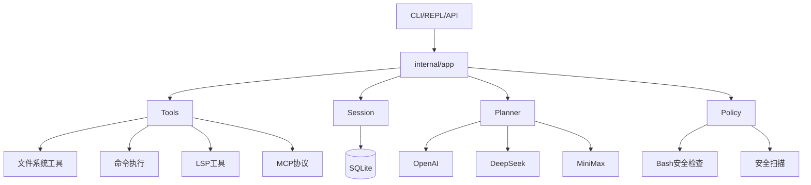

# 架构分析报告

> 生成时间: 2026-04-16
> 分析路径: /home/shiyi/share/github/morpheus

---

## 执行摘要

Morpheus 是一个功能完整的本地 AI Agent 运行时，支持工具执行、会话持久化、MCP 协议和交互式 TUI 客户端。项目采用模块化 Go 架构，约 28K 行代码，组织清晰，测试覆盖良好。主要风险是部分核心文件过大（如 runtime.go 达 3830 行），增加了维护成本。

### 关键发现

 | 类型    | 数量   | 最严重的问题                     |
 | ------  | ------ | -------------------------------- |
 | P0 问题 | 0      | 无                               |
 | P1 问题 | 2      | 大文件 (runtime.go 3830行)      |
 | P2 问题 | 4      | 多个 >500 行文件                 |
 | 优点    | 6      | 完善的模块化 + 安全策略 + 测试   |

---

## 1. 项目概述

### 基本信息

 | 项目信息   | 内容                  |
 | ---------- | ------                |
 | 项目名称   | Morpheus              |
 | 项目类型   | CLI / AI Agent Runtime|
 | 架构模式   | 模块化分层架构        |
 | 代码规模   | ~28,274 行, 100+ 文件 |

### 技术栈

 | 层级 | 技术 | 版本 |
 |------|------|------|
 | 语言 | Go | 1.25 |
 | CLI框架 | spf13/cobra | 1.8.0 |
 | 配置 | spf13/viper | 1.17.0 |
 | 数据库 | modernc/sqlite | 1.47.0 |
 | 日志 | uber/zap | 1.27.0 |
 | WebSocket | gorilla/websocket | 1.5.3 |

---

## 2. 架构分析

### 架构模式

项目采用**模块化分层架构**，按功能职责划分目录：

- `internal/app` - 核心 Agent 运行时 (loop, runtime, coordinator)
- `internal/tools` - 工具系统 (fs, cmd, lsp, mcp, webfetch 等)
- `internal/session` - 会话持久化 (SQLite)
- `internal/policy` - 安全策略 (bash_security, security_scanner)
- `internal/planner` - 规划器 (LLM adapter, providers)
- `pkg/sdk` - 对外 SDK

### 目录结构

 | 目录 | 职责 | 代码行数 |
 |------|------|----------|
 | internal/app | Agent 运行时核心 | ~12,000 |
 | internal/tools | 工具实现 | ~4,000 |
 | internal/planner | LLM 规划器 | ~3,000 |
 | internal/effect | 响应式编程框架 | ~2,500 |
 | internal/session | 会话存储 | ~3,000 |
 | internal/policy | 安全策略 | ~1,500 |
 | pkg/sdk | 公共接口 | ~1,500 |

### 架构图



---

## 3. 问题清单

### P0 - 立即修复

无

### P1 - 本周修复

 | 问题 | 位置 | 修复建议 |
 |------|------|----------|
 | 超大文件 | `internal/app/runtime.go` (3830行) | 按功能拆分为多个文件: runtime_builder.go, runtime_tools.go, runtime_mcp.go 等 |
 | 超大文件 | `internal/app/events_handlers.go` (1435行) | 拆分为独立的事件处理器文件 |

### P2 - 本季度规划

 | 问题 | 说明 | 建议 |
 |------|------|------|
 | 大文件 - compactor.go | 1247行 | 按压缩策略类型拆分 |
 | 大文件 - agent_loop.go | 1067行 | 拆分为 loop_stream.go |
 | 大文件 - lsp.go | 1423行 | 移至独立包 |
 | 大文件 - mcp.go | 1042行 | 拆分为 client/server |

---

## 4. 质量评估

### 优点

 | 维度     | 评分   | 说明        |
 | ------   | ------ | ------      |
 | 模块化   | ★★★★☆  | 按功能清晰划分目录，职责明确 |
 | 代码质量 | ★★★★☆  | 遵循 Go 规范，命名清晰 |
 | 测试覆盖 | ★★★☆☆  | 13个测试文件，覆盖核心模块 |
 | 文档     | ★★★★☆  | 完整的 README.md + SOUL.md |
 | CI/CD    | ★★★★☆  | GitHub Actions 工作流 |
 | 安全     | ★★★★★  | 完善的 bash_security + security_scanner |

### 需要改进

 | 维度   | 评分   | 说明   |
 | ------ | ------ | ------ |
 | 大文件 | ★★☆☆☆  | 多个核心文件超过 1000 行 |
 | 测试覆盖 | ★★★☆☆ | 仅 13 个测试文件，覆盖率偏低 |

---

## 5. 优化建议

### 优先级排序

1. **拆分 runtime.go** - 3830 行文件难以维护，建议拆分为 runtime_*.go 系列
2. **增加测试覆盖** - 补充 internal/app 的核心逻辑测试
3. **重构 events_handlers.go** - 按事件类型拆分处理器

### 具体建议

1. **runtime.go 拆分方案**:
   ```
   runtime.go (保留接口)
   → runtime_builder.go (构建器)
   → runtime_tools.go (工具管理)
   → runtime_mcp.go (MCP支持)
   → runtime_session.go (会话管理)
   ```

2. **测试补充建议**:
   - AgentLoop 核心循环测试
   - Coordinator 协调器测试
   - Session 持久化测试

---

## 综合评分

**总体评分: 4.0/5 (良好)**

项目整体质量良好，架构清晰，安全性考虑充分。主要改进点是大型文件的重构和测试覆盖的扩展。

---

*报告生成: 2026-04-16*
