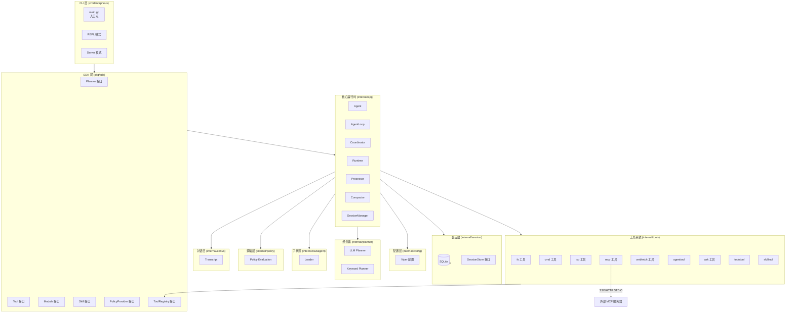

# morpheus 技术架构分析报告

> 自动生成时间: 2026-04-10
> 分析路径: /home/shiyi/share/github/morpheus

---

## 1. 项目概述

### 1.1 项目简介

| 项目信息 | 内容 |
|----------|------|
| 项目名称 | morpheus (github.com/zetatez/morpheus) |
| 项目类型 | AI Agent 运行时 / CLI 工具 / REST API 服务 |
| 核心功能 | 本地 AI Agent 运行时，支持工具执行、会话持久化、MCP 协议支持、交互式 TUI 客户端 |

### 1.2 技术栈

| 层级 | 技术 | 版本/说明 |
|------|------|-----------|
| 后端语言 | Go | 1.25.0 |
| 前端语言 | TypeScript | cli/ 目录，使用 Bun 运行时 |
| CLI 框架 | spf13/cobra | v1.8.0 |
| 配置管理 | spf13/viper | v1.17.0 |
| 数据库 | SQLite | modernc.org/sqlite v1.47.0 |
| 日志 | uber.org/zap | v1.27.0 |
| WebSocket | gorilla/websocket | v1.5.3 |
| LSP 协议 | go.lsp.dev/protocol | v0.12.0 |
| 前端框架 | solid-js | v1.9.12 |
| 构建工具 | Bun | cli/ 目录 |

### 1.3 系统规模

| 指标 | 数值 |
|------|------|
| 代码行数 | 40,985 行 |
| 源文件数 | 125 个 |
| 模块/目录数 | 61 个 |
| 测试文件数 | 12 个 |
| 测试覆盖率 | ~10% |
| Go 依赖数量 | 11 个直接依赖 |
| 二进制大小 | ~25MB (morpheus 可执行文件) |

---

## 2. 系统架构分析

### 2.1 架构模式

**识别结果:** 模块化插件架构 (Module-based Plugin Architecture)

**特征依据:**
- pkg/sdk 定义了清晰的接口抽象层 (Planner, Tool, Module, Skill, PolicyProvider 等)
- internal/tools 采用插件式工具注册机制 (registry)
- internal/subagent 支持动态加载子代理定义
- internal/skill 支持技能系统的热加载
- 支持 MCP (Model Context Protocol) 协议扩展

### 2.2 架构图



### 2.3 项目结构

```
morpheus/
├── cmd/
│   └── morpheus/
│       └── main.go              # 入口点
├── cli/
│   ├── src/                     # TypeScript 前端 (Solid.js)
│   ├── package.json
│   └── node_modules/
├── internal/
│   ├── app/                     # 核心运行时 (~50 个 .go 文件)
│   │   ├── runtime.go           # 运行时主逻辑 (115KB)
│   │   ├── agent_loop.go        # Agent 循环
│   │   ├── coordinator.go       # 协调器
│   │   ├── processor.go        # 处理器
│   │   ├── compactor.go        # 上下文压缩
│   │   └── events*.go          # 事件处理
│   ├── tools/                   # 工具系统
│   │   ├── fs/                  # 文件操作工具
│   │   ├── cmd/                 # 命令执行工具
│   │   ├── lsp/                 # LSP 工具
│   │   ├── mcp/                 # MCP 客户端
│   │   ├── webfetch/            # Web 获取工具
│   │   └── registry/            # 工具注册表
│   ├── session/                 # 会话管理
│   │   └── store_sqlite.go      # SQLite 存储
│   ├── planner/                 # 规划器
│   │   ├── llm/                 # LLM 规划器
│   │   └── keyword/             # 关键词规划器
│   ├── subagent/                # 子代理系统
│   ├── skill/                   # 技能系统
│   ├── policy/                  # 策略评估
│   ├── convo/                   # 对话管理
│   ├── config/                  # 配置管理
│   └── cli/                     # CLI 相关
├── pkg/
│   └── sdk/                     # SDK 接口定义
│       └── interfaces.go
├── config.yaml                  # 配置文件
├── go.mod / go.sum
└── README.md
```

### 2.4 模块划分

| 模块 | 职责 | 位置 |
|------|------|------|
| CLI 入口 | 命令行入口，REPL/Server 模式选择 | cmd/morpheus |
| 核心运行时 | Agent 执行循环、事件处理、流程控制 | internal/app |
| 工具系统 | 文件操作、命令执行、LSP、MCP 等 | internal/tools |
| 会话存储 | SQLite 会话持久化 | internal/session |
| 规划器 | LLM 规划、关键词规划 | internal/planner |
| 子代理 | 动态加载子代理定义 | internal/subagent |
| 技能系统 | 技能热加载 | internal/skill |
| 策略层 | 操作风险评估 | internal/policy |
| SDK | 核心接口抽象 | pkg/sdk |

### 2.5 服务通信方式

| 通信模式 | 使用场景 | 技术实现 |
|----------|----------|----------|
| 同步调用 | Agent → Tools | Go 接口直接调用 |
| 事件流 | 运行时事件 | Server-Sent Events (SSE) |
| WebSocket | 远程控制 | gorilla/websocket |
| STDIO | MCP 服务通信 | 进程标准输入/输出 |
| HTTP/SSE | MCP 远程服务 | MCP 协议 |
| SQLite | 会话持久化 | WAL 模式 |

---

## 3. 实现分析

### 3.1 代码结构

**组织方式:**
- 采用 Go 语言的典型项目结构 (`cmd/`, `internal/`, `pkg/`)
- `internal/` 下按功能模块划分目录，而非传统的 Controller/Service/Repository 分层
- `pkg/sdk` 提供接口抽象，供 `internal/` 实现
- `cli/` 目录包含独立的前端 TypeScript 项目

**模块划分合理性:**
- 模块边界清晰，职责单一
- 通过接口抽象实现解耦
- 工具系统采用注册表模式，便于扩展

### 3.2 设计模式使用

| 模式 | 使用场景 |
|------|----------|
| 接口抽象 | pkg/sdk 定义核心接口 |
| 注册表模式 | ToolRegistry 管理工具注册 |
| 适配器模式 | ToolHandlerAdapter, CallbacksAdapter |
| 策略模式 | 多 Planner 实现 (LLM/Keyword) |
| 插件模式 | Module/Skill 系统 |
| 工厂模式 | PlannerFactory 创建规划器 |

### 3.3 代码质量

| 维度 | 评分 | 说明 |
|------|------|------|
| 命名规范 | ★★★★☆ | 命名清晰，遵循 Go 惯例 |
| 函数长度 | ★★★☆☆ | runtime.go 单文件较大 |
| 圈复杂度 | ★★★☆☆ | 部分函数较复杂 |
| 重复代码 | ★★★★☆ | 无明显重复 |
| 接口设计 | ★★★★★ | 接口定义清晰，职责分明 |

---

## 4. 技术亮点与优点

### 4.1 架构优势

1. **模块化设计**
   - 通过 `pkg/sdk` 清晰定义接口契约
   - 各模块职责单一，易于理解和维护
   - 工具系统采用注册表模式，支持动态扩展

2. **插件化 MCP 支持**
   - 支持 STDIO、HTTP、SSE 三种 MCP 传输方式
   - MCP 服务器可动态配置

3. **会话持久化**
   - SQLite WAL 模式保证并发安全
   - 支持上下文压缩 (Compactor)
   - 会话历史长期保留 (720h 默认)

### 4.2 技术亮点

1. **智能上下文管理**
   - Token 预算动态压缩
   - 多层压缩策略 (摘要、工具输出裁剪)

2. **多规划器支持**
   - 支持 OpenAI、MiniMax、GLM、DeepSeek、Anthropic 等多种 LLM
   - 内置 Keyword 规划器 (无需 API Key)

3. **风险感知执行**
   - 细粒度的权限风险分级
   - 保护路径配置防止误操作

### 4.3 代码质量优点

- 使用 zap 高性能日志库
- 配置外置，支持环境变量
- 错误处理规范
- SQLite WAL 模式优化并发

---

## 5. 缺点与潜在问题

### 5.1 P1 - 重要问题

| 问题 | 严重程度 | 说明 | 位置 |
|------|----------|------|------|
| 硬编码地址 | 中 | 多处 localhost/127.0.0.1 硬编码 | events_openapi.go:14, repl.go:211,225,229 |
| WebSocket 安全 | 中 | 远程控制无认证机制 (bearer_token 为可选) | runtime.go |

### 5.2 P2 - 一般问题

| 问题 | 说明 | 位置 |
|------|------|------|
| 测试覆盖不足 | 测试文件仅 12 个，覆盖率约 10% | internal/ |
| 大二进制文件 | 可执行文件约 25MB | ./morpheus |
| 缺少 CI/CD | 未检测到 GitHub Actions/Jenkins 等 | - |
| 循环依赖 | runtime.go 依赖较多模块 | internal/app/runtime.go |

### 5.3 P3 - 改进建议

| 问题 | 说明 |
|------|------|
| 缺少 Benchmark | 性能测试不足 |
| 大文件拆分 | runtime.go (115KB) 建议拆分 |
| goreleaser 配置 | 已有 .goreleaser.yaml，可完善 |

---

## 6. 优化与改进建议

### 6.1 P1 - 规划处理

**硬编码地址问题**

**问题描述:**
代码中多处硬编码 localhost/127.0.0.1 地址，降低了部署灵活性。

**优化方案:**
1. 将服务器地址配置化
2. 使用 viper 读取配置项
3. 提供环境变量覆盖

**实施步骤:**
1. 在 config.yaml 中添加 `server.host` 配置项
2. 修改 events_openapi.go 中的硬编码 `http://localhost`
3. 修改 repl.go 中的默认连接地址
4. 添加单元测试验证

**预期收益:**
提升多环境部署能力

**实施难度:**
低

---

### 6.2 P2 - 持续改进

**测试覆盖率提升**

**问题描述:**
当前测试覆盖率约 10%，存在较高质量风险。

**优化方案:**
1. 为核心模块 (agent_loop, coordinator, processor) 添加单元测试
2. 引入集成测试框架
3. 使用 mockery 生成 mock 代码

**实施步骤:**
1. 安装 golang.org/x/tools/cmd/goimports 等工具
2. 为关键接口生成 mock
3. 编写核心流程的集成测试
4. 配置 CI 进行覆盖率检查

**预期收益:**
降低回归风险，提升代码质量信心

**实施难度:**
中

---

### 6.3 P3 - 未来规划

**大型文件拆分**

runtime.go (115KB) 建议按职责拆分为多个小文件:
- runtime_builder.go (已存在)
- runtime_session.go (已存在)
- runtime_tools.go (已存在)
- runtime_mcp.go (已存在)
- runtime_*.go 系列文件

---

## 7. 结论

### 7.1 总体评价

| 维度 | 评分 | 说明 |
|------|------|------|
| 架构设计 | ★★★★☆ | 模块化清晰，插件化架构合理 |
| 代码质量 | ★★★★☆ | 命名规范，接口设计良好 |
| 可维护性 | ★★★★☆ | 模块划分清晰，依赖管理规范 |
| 扩展性 | ★★★★★ | 插件系统、MCP 支持优秀 |
| 安全性 | ★★★☆☆ | 有待加强 (硬编码、认证) |
| 性能 | ★★★★☆ | SQLite WAL、zap 日志优化 |

### 7.2 改进建议优先级

1. **P1**: 解决硬编码地址问题，提升部署灵活性
2. **P2**: 提升测试覆盖率，完善 CI/CD
3. **P3**: 大文件拆分，添加性能测试

### 7.3 长期规划建议

- 引入完整的 CI/CD 流程
- 完善监控和追踪体系 (OpenTelemetry)
- 考虑将部分核心模块提取为独立库
- 优化二进制大小 (使用 upx 或模块裁剪)

---

## 附录

### A. 关键文件清单

| 文件 | 说明 |
|------|------|
| cmd/morpheus/main.go | 应用入口 |
| internal/app/runtime.go | 运行时主逻辑 (115KB) |
| internal/app/agent_loop.go | Agent 执行循环 |
| pkg/sdk/interfaces.go | 核心接口定义 |
| internal/tools/registry/registry.go | 工具注册表 |
| internal/session/store_sqlite.go | SQLite 会话存储 |
| config.yaml | 配置文件 |

### B. 依赖清单

| 依赖 | 版本 | 用途 |
|------|------|------|
| spf13/cobra | v1.8.0 | CLI 框架 |
| spf13/viper | v1.17.0 | 配置管理 |
| gorilla/websocket | v1.5.3 | WebSocket 支持 |
| modernc.org/sqlite | v1.47.0 | SQLite 数据库 |
| uber.org/zap | v1.27.0 | 日志库 |
| go.lsp.dev/protocol | v0.12.0 | LSP 协议 |
| google/uuid | v1.6.0 | UUID 生成 |
| fsnotify/fsnotify | v1.6.0 | 文件监控 |

### C. 检测命令记录

```bash
# 项目结构探测
ls -la && find . -maxdepth 3 -type d

# 技术栈识别
go.mod, package.json

# 依赖分析
go mod graph, cat go.mod

# 架构检测
find . -type d \( -name "controller" -o -name "service" \)
find . -type d \( -name "domain" -o -name "infrastructure" \)

# 问题检测
grep -rn "localhost\|127\.0\.0\.1"
grep -rnE "(TODO|FIXME|HACK|XXX)"

# 规模统计
find . -type f \( -name "*.go" -o -name "*.ts" \) -exec wc -l {} +
```

---

*报告生成时间: 2026-04-10*
