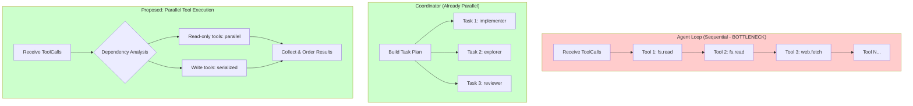

# Morpheus Concurrency/Parallelism Analysis Report

> Generated: 2026-04-07  
> Analysis Focus: Agent response speed improvement through concurrency

---

## Executive Summary

The Morpheus codebase has **significant untapped parallelism opportunities**. The coordinator system already demonstrates proper parallel sub-agent execution, but the main agent loop executes all tool calls **sequentially**. The codebase contains an **unused `WorkerPool` implementation** that could enable parallel tool execution.

### Key Findings by Impact

| Priority | Opportunity | Current State | Speedup Potential |
|----------|-------------|---------------|-------------------|
| **P1** | Tool call parallelization | Sequential loop | 2-4x |
| **P1** | CLI parallel task display | Single banner | UX improvement |
| **P2** | Memory extraction async | Synchronous | Marginal |
| **P2** | Session persistence async | Blocking | Minor |
| **P3** | I/O operation parallelization | Per-tool blocking | Task-dependent |

---

## 1. Agent Loop & Tool Execution (HIGHEST IMPACT)

### 1.1 Main Agent Loop - Sequential Tool Execution

**Location:** `internal/app/agent_runner.go:318-480`

```go
// Line 318: Sequential loop - THE BOTTLENECK
for _, call := range resp.ToolCalls {
    // ...
    // Line 345: Blocking call - waits for each tool to complete
    result, execErr := rt.orchestrator.ExecuteStep(toolCtx, sessionID, planStep)
    // ... processes result before next iteration
}
```

**Problem:**
- Each tool call waits for the previous one to complete
- Independent tools (e.g., multiple `fs.read` calls to different files) run sequentially
- Latency = sum of all tool execution times

**Proposed Solution:**
Use the existing `WorkerPool` from `exec/worker_pool.go` to parallelize independent tool calls:

```go
// After resp.ToolCalls received (line 314):
// Convert to WorkerPool inputs
calls := make([]exec.ToolCallInput, len(resp.ToolCalls))
for i, call := range resp.ToolCalls {
    calls[i] = exec.ToolCallInput{
        ID:        call.ID,
        Name:      call.Name,
        Arguments: call.Arguments,
    }
}

// Execute in parallel using existing WorkerPool
results := exec.DefaultWorkerPool.ExecuteToolCalls(ctx, calls, func(ctx context.Context, input exec.ToolCallInput) sdk.ToolResult {
    // ... execute step logic
})
```

### 1.2 WorkerPool - Existing but Unused

**Location:** `internal/exec/worker_pool.go:1-84`

```go
type WorkerPool struct {
    workers int
    sem     chan struct{}  // Semaphore for concurrency control
    wg      sync.WaitGroup
}

func (wp *WorkerPool) ExecuteToolCalls(ctx context.Context, calls []ToolCallInput, 
    executor func(context.Context, ToolCallInput) sdk.ToolResult) []sdk.ToolResult
```

**Current Usage:** `exec/worker_pool.go:84` - `var DefaultWorkerPool = NewWorkerPool(3)`

**Problem:** `DefaultWorkerPool` is created but **never used** anywhere in the codebase!

**Required Changes:**
1. Import `execpkg "github.com/zetatez/morpheus/internal/exec"` in `agent_runner.go`
2. Replace sequential tool execution loop with `WorkerPool.ExecuteToolCalls()`
3. Handle results in order while tools execute in parallel

### 1.3 Race Conditions & Synchronization

**Potential Issues:**
1. **Message append order** - `appendMessage` must preserve order for LLM context
   - **Solution:** Collect results in order, then append in sequence
   
2. **RunState updates** - `run.Results`, `run.Todos` updated per tool
   - **Solution:** Use mutex protection (already in place via `run.mu`)
   
3. **Episodic memory** - `addEpisodicMemory` called after each tool
   - **Solution:** Results collected first, memory updated after

4. **Event emission order** - `onToolPending` and `onToolResult` callbacks
   - **Solution:** Emit events as results complete (not in order)

### 1.4 Speedup Estimation

**Scenario:** Agent makes 4 independent file reads to answer a question
- Current: ~400ms + ~400ms + ~400ms + ~400ms = ~1600ms total
- With parallelization: ~400ms (all run concurrently)
- **Speedup: ~4x**

**Constraints:**
- Need to identify truly independent tools (no shared state dependencies)
- Tools that modify state (`fs.write`, `fs.edit`) should serialize
- Max concurrent tools should be configurable (currently default is 3)

---

## 2. Coordinator System (REFERENCE IMPLEMENTATION)

**Location:** `internal/app/coordinator.go:190-321`

The coordinator already implements proper parallel execution:

### 2.1 Parallel Task Execution

```go
// coordinator.go:206-238 - runTasksParallel
func runTasksParallel(ctx context.Context, rt *Runtime, sessionID string, 
    tasks []coordinatorTask, emit replEmitter) []coordinatorResult {
    
    results := make([]coordinatorResult, len(tasks))
    var wg sync.WaitGroup
    maxConcurrent := rt.cfg.Agent.MaxConcurrentTasks  // Configurable!
    if maxConcurrent <= 0 {
        maxConcurrent = 3
    }
    limit := make(chan struct{}, maxConcurrent)  // Semaphore
    
    for i, task := range tasks {
        wg.Add(1)
        go func(idx int, task coordinatorTask) {
            defer wg.Done()
            defer func() { <-limit }()
            // Execute task
            summary, err := rt.RunSubAgentWithProfile(ctx, profile, ...)
            results[idx] = res
        }(i, task)
    }
    wg.Wait()
    return results
}
```

### 2.2 DAG-Based Execution with Dependencies

```go
// coordinator.go:241-321 - runTasksDAG
func runTasksDAG(ctx context.Context, rt *Runtime, sessionID string, 
    tasks []coordinatorTask, emit replEmitter) []coordinatorResult {
    
    // Calculate in-degrees for DAG scheduling
    inDegree := make(map[string]int)
    for _, task := range tasks {
        inDegree[task.ID] = len(task.DependsOn)
    }
    
    // Wait for dependencies with mutex-protected polling
    for _, depID := range task.DependsOn {
        mu.Lock()
        for !completed[depID] {
            mu.Unlock()
            time.Sleep(100 * time.Millisecond)  // Polling - could use condition variable
            mu.Lock()
        }
        mu.Unlock()
    }
    // Execute task
}
```

**Key Patterns to Replicate in Agent Loop:**
1. Semaphore-based concurrency limiting
2. WaitGroup for completion tracking
3. Configurable max concurrent tasks
4. Results collected in order despite parallel execution

---

## 3. Session & Message Handling

### 3.1 RunState Locking

**Location:** `internal/app/run_state.go:41-69`

```go
type RunState struct {
    // ...
    Subscribers map[chan RunEvent]struct{}
    mu          sync.Mutex  // Protects: Status, Reply, Err, Results, Todos, Events
}
```

**Current Locking Pattern:**
```go
// Line 334: run.Status = RunStatusWaitingTool
run.mu.Lock()
run.Status = RunStatusWaitingTool
// ... updates ...
run.mu.Unlock()
```

**Issues:**
- No read-write lock pattern (RWMutex would allow concurrent reads)
- Event append under lock (line 151-162)

### 3.2 Message Append

**Location:** `internal/convo/manager.go:56-78`

```go
func (m *Manager) AppendWithParts(...) {
    m.mu.Lock()
    defer m.mu.Unlock()
    // Append to session messages
    m.sessions[sessionID].Messages = append(...)
}
```

**Issue:** Append is exclusive, but this is correct for message ordering.

### 3.3 Concurrency Opportunities

| Component | Current | Opportunity |
|-----------|---------|--------------|
| RunState reads | RWMutex | Already efficient |
| Message append | Mutex | Already correct for ordering |
| Event broadcast | Per-subscriber channels | Already non-blocking |

**Verdict:** Session/message handling is already thread-safe; minimal gains from changes here.

---

## 4. Tool Orchestration

### 4.1 Orchestrator ExecuteStep

**Location:** `internal/exec/orchestrator.go:145-188`

```go
func (o *Orchestrator) ExecuteStep(ctx context.Context, sessionID string, 
    step sdk.PlanStep) (sdk.ToolResult, error) {
    
    tool, ok := o.registry.Get(step.Tool)
    // Policy check
    res, err := tool.Invoke(ctx, inputs)
    return res, nil
}
```

**Each tool invocation is blocking.** To parallelize:
1. Create goroutine per tool
2. Use semaphore to limit concurrency
3. Collect results via channel

### 4.2 Tool Categories for Parallelization

| Tool | Read-Only | Parallelizable | Notes |
|------|-----------|----------------|-------|
| `fs.read` | Yes | Yes | Different files = independent |
| `fs.glob` | Yes | Yes | Read-only search |
| `fs.grep` | Yes | Yes | Read-only search |
| `fs.ls` | Yes | Yes | Directory listing |
| `fs.tree` | Yes | Yes | Read-only |
| `web.fetch` | Yes | **Yes** | Network I/O |
| `git.diff` | Yes | Yes | Read-only git |
| `git.status` | Yes | Yes | Read-only git |
| `cmd.exec` | No | **Caution** | Side effects possible |
| `fs.write` | No | **No** | State modification |
| `fs.edit` | No | **No** | State modification |

**Strategy:** Only parallelize read-only tools; serialize state-modifying tools.

---

## 5. CLI Output & Progress Display

### 5.1 Current Implementation

**Location:** `cli/src/app.tsx:609-621`

```typescript
if (runType === "tool_execution_started") {
    const tool = String((evt.data.data ?? {})["tool"] ?? "tool")
    setActiveRunBanner(`Executing ${tool}...`)  // Single banner!
    return
}
if (runType === "tool_execution_finished") {
    const tool = String(data["tool"] ?? "tool")
    setActiveRunBanner(success ? `Finished ${tool}` : `${tool} failed`)
    // Single status update
}
```

**Current Display:** Only ONE running tool can be shown at a time via `activeRunBanner`.

### 5.2 Team Task Display (Reference)

**Location:** `cli/src/components/TeamTaskComponents.tsx`

```typescript
// Team tasks display shows status for each task
<For each={props.tasks}>
    {(task) => {
        const statusIcon = () => {
            if (task.status === "completed") return "[x]"
            if (task.status === "running") return props.taskPulse ? "[•]" : "[>]"
            if (task.status === "failed") return "[!]"
            // ...
        }
        return (
            <text fg={taskStatusColor(task.status, props.taskPulse)}>
                {`${statusIcon()} [${task.role}] ${truncate(task.prompt, 40)}`}
            </text>
        )
    }}
</For>
```

**Team task display shows each task independently** - status icon, role, prompt, summary.

### 5.3 Proposed CLI Enhancement for Parallel Tools

**Problem:** When multiple tools run in parallel, CLI can only show one status.

**Solution:** Implement multi-line tool status display:

```typescript
// New data structure
interface ToolExecution {
    id: string
    tool: string
    status: 'running' | 'completed' | 'failed'
    startTime: number
}

// In app.tsx
const [runningTools, setRunningTools] = createSignal<ToolExecution[]>([])

if (runType === "tool_execution_started") {
    const tool = String(data["tool"] ?? "tool")
    const callId = String(data["call_id"] ?? "")
    setRunningTools([...runningTools(), { id: callId, tool, status: 'running', startTime: Date.now() }])
}

if (runType === "tool_execution_finished") {
    const callId = String(data["call_id"] ?? "")
    const success = Boolean(data["success"])
    setRunningTools(runningTools().map(t => 
        t.id === callId ? { ...t, status: success ? 'completed' : 'failed' } : t
    ))
    // Remove completed after delay
    setTimeout(() => {
        setRunningTools(runningTools().filter(t => t.id !== callId))
    }, 2000)
}

// Display in UI - multiple running tools shown simultaneously
<For each={runningTools()}>
    {(tool) => (
        <text fg={tool.status === 'running' ? theme.primary : 
                  tool.status === 'completed' ? theme.success : theme.error}>
            {tool.status === 'running' ? `>[•] ${tool.tool}` : 
             tool.status === 'completed' ? `[x] ${tool.tool}` : `[!] ${tool.tool} failed`}
        </text>
    )}
</For>
```

### 5.4 Required Backend Changes

**Current events:** `tool_execution_started`, `tool_execution_finished`

**Needed for parallel display:**
- Include `call_id` in events (already included)
- Events already have correct structure - frontend just needs to handle multiple in-flight tools

---

## 6. I/O Operations

### 6.1 File System Tools

**Location:** `internal/tools/fs/fs.go`

All FS tools accept `context.Context` but execute blocking I/O:
- `ReadTool.Invoke` - `os.ReadFile` (line 307)
- `WriteTool.Invoke` - `os.WriteFile` (line 408)
- `EditTool.Invoke` - read-modify-write (line 435, 458)
- `GlobTool.Invoke` - `filepath.Glob` (line 618)
- `GrepTool.Invoke` - `filepath.WalkDir` + `os.ReadFile` (line 671)

**Parallelization:** Multiple FS tools reading different files can run concurrently.

### 6.2 Web Fetch

**Location:** `internal/tools/webfetch/webfetch.go:41-99`

```go
func (t *FetchTool) Invoke(ctx context.Context, input map[string]any) (sdk.ToolResult, error) {
    // Line 66: Blocking HTTP request
    resp, err := t.client.Do(req)
}
```

**Current:** Single `http.Client` with default transport (connection pool).

**Parallelization Opportunity:** Multiple `web.fetch` calls could use separate clients or connection pooling.

### 6.3 Git Operations

**Location:** `internal/tools/git/git.go:40-86`

```go
func (t *DiffTool) Invoke(ctx context.Context, input map[string]any) (sdk.ToolResult, error) {
    return runGitCmd(ctx, t.workspace, "diff", args)
}

func runGitCmd(ctx context.Context, dir, subcmd string, args string) (sdk.ToolResult, error) {
    cmd := exec.CommandContext(ctx, "git", subcmd, args)
    cmd.Dir = dir
    err := cmd.Run()  // Blocking
}
```

**Note:** Git operations modify repository state only for writes. Read operations (`diff`, `status`) are parallelizable.

---

## 7. Memory System

### 7.1 Semantic Extraction

**Location:** `internal/app/memory.go:286-315`

```go
func (m *MemorySystem) ExtractSemanticFromEpisodic(ctx context.Context) int {
    m.mu.Lock()
    defer m.mu.Unlock()
    
    m.extractionCount++
    if m.extractionCount < SemanticExtractionThreshold {
        return 0
    }
    // ...
}
```

**Current Call Chain (agent_runner.go:434-439):**
```go
rt.addEpisodicMemory(sessionID, ...)
if rt.memorySystem(sessionID).ShouldExtract() {
    extracted := rt.memorySystem(sessionID).ExtractSemanticFromEpisodic(ctx)
    // Blocking call after each tool!
}
```

### 7.2 Concurrency Opportunity

**Problem:** `ExtractSemanticFromEpisodic` is called after **every** tool, blocking the main loop.

**Solution:** Run extraction in background:

```go
// In agent_runner.go, after tool execution:
go func() {
    extracted := rt.memorySystem(sessionID).ExtractSemanticFromEpisodic(context.Background())
    if extracted > 0 {
        rt.logger.Debug("extracted semantic memories", zap.Int("count", extracted))
    }
}()
```

**Note:** `ExtractSemanticFromEpisodic` holds `m.mu.Lock()` during execution, so concurrent calls would serialize anyway. Better to only call periodically.

---

## 8. Summary of Concurrency Opportunities

### 8.1 Priority Matrix

| Priority | Opportunity | Effort | Impact | Risk |
|----------|-------------|--------|--------|------|
| **P1** | Parallel tool execution | Medium | High | Medium |
| **P1** | CLI multi-tool display | Low | High | Low |
| **P2** | Background semantic extraction | Low | Low | Low |
| **P2** | Async session persistence | Medium | Low | Medium |
| **P3** | I/O tool parallelization | Low | Medium | Low |

### 8.2 Implementation Roadmap

#### Phase 1: Tool Parallelization (Highest Impact)

**Files to Modify:**
1. `internal/app/agent_runner.go` - Replace sequential loop with WorkerPool
2. `internal/exec/orchestrator.go` - Ensure thread-safe tool execution

**Steps:**
1. Create wrapper function for tool execution
2. Replace `for _, call := range resp.ToolCalls` loop with `WorkerPool.ExecuteToolCalls()`
3. Handle results in order after parallel execution
4. Emit events as tools complete
5. Add configuration for max parallel tools

**Estimated Speedup:** 2-4x for multi-tool tasks

#### Phase 2: CLI Enhancement

**Files to Modify:**
1. `cli/src/app.tsx` - Track multiple in-flight tools
2. `cli/src/components/` - Add multi-tool status display

**Steps:**
1. Create `runningTools` signal
2. Update handlers to add/remove from runningTools
3. Display all running tools with status icons
4. Animate pulse for running tools

#### Phase 3: Memory System

**Files to Modify:**
1. `internal/app/agent_runner.go` - Background extraction

**Steps:**
1. Wrap `ExtractSemanticFromEpisodic` in goroutine
2. Add periodic extraction instead of per-tool

---

## 9. Architecture Diagram



---

## 10. Specific Code Changes Required

### 10.1 agent_runner.go Changes

**Location:** Lines 318-480 (tool execution loop)

**Current (sequential):**
```go
for _, call := range resp.ToolCalls {
    toolName := nameMap[call.Name]
    // ...
    result, execErr := rt.orchestrator.ExecuteStep(toolCtx, sessionID, planStep)
    // ...
}
```

**Proposed (parallel):**
```go
// Build parallel execution inputs
type parallelToolCall struct {
    call       toolCall
    toolName   string
    planStep   sdk.PlanStep
    fingerprint string
}

calls := make([]exec.ToolCallInput, len(resp.ToolCalls))
toolCallsData := make([]parallelToolCall, len(resp.ToolCalls))

for i, call := range resp.ToolCalls {
    toolName := nameMap[call.Name]
    if toolName == "" {
        toolName = call.Name
    }
    fingerprint := actionFingerprint(toolName, call.Arguments)
    
    toolCallsData[i] = parallelToolCall{
        call:     call,
        toolName: toolName,
        planStep: sdk.PlanStep{
            ID:          uuid.NewString(),
            Description: fmt.Sprintf("Tool call: %s", toolName),
            Tool:        toolName,
            Inputs:      call.Arguments,
            Status:      sdk.StepStatusRunning,
        },
        fingerprint: fingerprint,
    }
    
    calls[i] = exec.ToolCallInput{
        ID:        call.ID,
        Name:      toolName,
        Arguments: call.Arguments,
    }
}

// Execute parallel
results := exec.DefaultWorkerPool.ExecuteToolCalls(ctx, calls, 
    func(ctx context.Context, input exec.ToolCallInput) sdk.ToolResult {
        // Find corresponding planStep
        var planStep sdk.PlanStep
        for i, td := range toolCallsData {
            if td.call.ID == input.ID {
                planStep = td.planStep
                break
            }
        }
        
        toolCtx, toolCancel := context.WithTimeout(ctx, run.ToolTimeout)
        result, _ := rt.orchestrator.ExecuteStep(toolCtx, sessionID, planStep)
        toolCancel()
        return result
    })

// Process results in order
for i, td := range toolCallsData {
    result := results[i]
    // ... existing result processing logic (lines 348-430)
}
```

### 10.2 Configuration

**Add to `internal/config/config.go`:**
```go
type AgentConfig struct {
    // ...
    MaxParallelTools int `yaml:"max_parallel_tools"`
}
```

**Default value:** 3 (matching existing WorkerPool default)

---

## 11. Testing Recommendations

1. **Unit Test:** Parallel tool execution with mocked tools
2. **Integration Test:** Multiple `fs.read` calls complete in parallel
3. **Race Condition Test:** Verify message ordering preserved
4. **Load Test:** Measure latency improvement with 4+ tools

---

## 12. Conclusion

The Morpheus codebase has substantial concurrency potential that is **not currently exploited** in the main agent loop. The coordinator system provides an excellent reference implementation for how parallel execution should work.

**Highest Priority Actions:**
1. Integrate the unused `WorkerPool` into the agent loop
2. Update CLI to display multiple running tools
3. Serialize state-modifying tools while parallelizing read-only tools

**Expected Outcome:** 2-4x speedup for multi-tool tasks without fundamental architecture changes.

---

*Report generated by automated code analysis*
