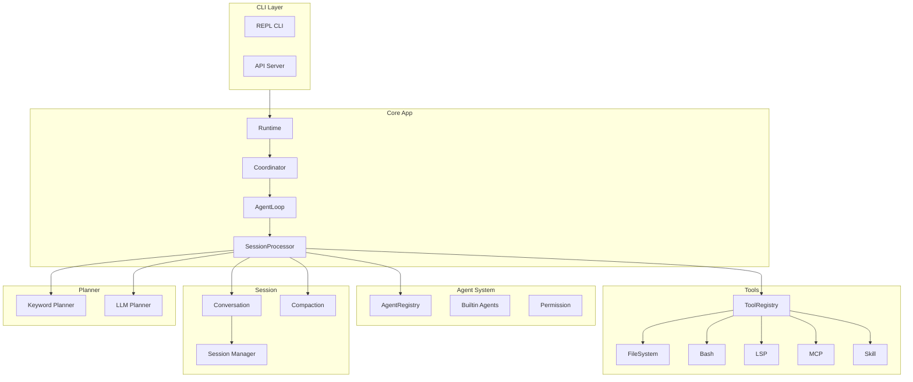
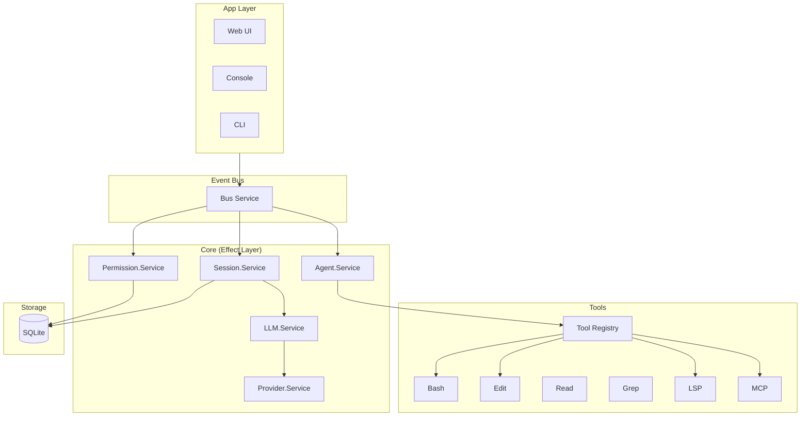

# Morpheus 与 Opencode 架构对比分析报告

> 分析时间: 2026-04-10
> Morpheus: Go AI Coding Assistant
> Opencode: TypeScript/Node.js AI Coding Assistant

---

## 1. 项目概述

### 1.1 Morpheus

| 属性 | 值 |
|------|-----|
| 语言 | Go 1.25 |
| 代码规模 | ~32,282 行 |
| 测试文件 | 12 个 |
| 架构模式 | 分层架构 + 工具注册表 |
| 依赖管理 | go.mod |

**核心模块:**
- `internal/app` - 应用核心 (agent、loop、coordinator、runtime)
- `internal/tools` - 工具实现 (fs、cmd、lsp、mcp、skill)
- `internal/planner` - 规划器 (keyword、llm)
- `internal/convo` - 对话管理
- `internal/session` - 会话管理
- `internal/skill` - 技能加载

### 1.2 Opencode

| 属性 | 值 |
|------|-----|
| 语言 | TypeScript/Bun |
| 架构模式 | Effect+ServiceMap 依赖注入 |
| 包管理 | Turborepo monorepo |
| 核心包 | packages/opencode (主逻辑) |

**核心模块 (packages/opencode/src/):**
- `agent/` - Agent 系统
- `permission/` - 权限系统
- `session/` - 会话处理 (含 compaction、retry、overflow)
- `effect/` - Effect 运行时 (run-service、instance-state)
- `tool/` - 工具实现
- `provider/` - LLM Provider
- `skill/` - 技能系统
- `mcp/` - MCP 协议
- `lsp/` - LSP 协议
- `server/` - 服务器
- `storage/` - 存储层
- `bus/` - 事件总线
- `sync/` - 同步机制

---

## 2. 架构对比

### 2.1 架构模式

| 方面 | Morpheus | Opencode |
|------|----------|----------|
| **依赖注入** | 手动注入 (构造函数) | Effect+ServiceMap 自动化 |
| **模块组织** | 按功能分层 | 按领域划分 (DDD-lite) |
| **状态管理** | Runtime struct + sync.Map | InstanceState + Effect.Context |
| **事件系统** | 简单的 callback | Bus 事件总线 |
| **错误处理** | 常规 Go error | TaggedError + Effect cause |

### 2.2 Agent 系统对比

#### Morpheus Agent

```go
type Agent struct {
    Name        string
    Description string
    Mode        AgentKind  // primary/subagent/all
    Native      bool
    Hidden      bool
    TopP        float64
    Temperature float64
    Color       string
    Variant     string
    Prompt      string
    Steps       int
    Options     map[string]any
    Permission  PermissionRuleset
    Model       *ModelOverride
}
```

**已实现:**
- ✅ Mode (primary/subagent)
- ✅ Native/Hidden 标志
- ✅ Temperature/TopP
- ✅ Variant
- ✅ Prompt
- ✅ Permission (per-agent ruleset)
- ✅ Model override
- ✅ Options
- ✅ ApplyConfig 动态配置

**缺失:**
- ❌ Agent 生成能力 (LLM-based agent generation)

#### Opencode Agent

```typescript
const agents: Record<string, Info> = {
  build: { mode: "primary", native: true, permission: [...] },
  plan: { mode: "primary", native: true, permission: [...] },
  general: { mode: "subagent", native: true, permission: [...] },
  explore: { mode: "subagent", native: true, permission: [...] },
  compaction: { mode: "primary", native: true, hidden: true },
  title: { mode: "primary", native: true, hidden: true },
  summary: { mode: "primary", native: true, hidden: true },
}
```

**特点:**
- 每个 agent 有详细的 permission ruleset
- 支持 `external_directory` 权限控制
- Agent 可以通过配置文件覆盖
- 有 `generate()` 方法用 LLM 生成新 agent

### 2.3 Permission 系统对比

#### Morpheus Permission

```go
type PermissionRule struct {
    Permission string
    Pattern    string
    Action     PermissionAction  // allow/deny/ask
}

type PermissionRuleset []PermissionRule
```

**特点:**
- 简单的规则匹配
- 支持通配符 `*`
- 需要用户交互 (PendingConfirmation)
- **缺失:** 持久化approved规则、always/once/reject 回复机制

#### Opencode Permission

```typescript
export const Reply = z.enum(["once", "always", "reject"])
export interface PendingEntry {
    info: Request
    deferred: Deferred.Deferred<void, RejectedError | CorrectedError>
}
```

**特点:**
- **三种回复模式:** once/always/reject
- **持久化:** approved 规则存入数据库
- **异步:** 使用 Deferred + Bus 事件
- **错误类型:** DeniedError/RejectedError/CorrectedError
- **disabled()** 方法: 批量检查工具是否被禁用

### 2.4 Session/Loop 对比

#### Morpheus Session Loop

- `agent_loop.go` - Agent 循环入口
- `loop.go` - RunLoop 实现 (734行)
- `processor.go` - 会话处理器
- `compaction.go` - 压缩处理
- `compactor.go` - 4层压缩管道

**特点:**
- 同步循环
- 手动重试机制
- ProgressTracker 检测 doom loop
- Callback 模式

#### Opencode Session Processor

- `session/processor.ts` - 主处理器 (532行)
- `session/compaction.ts` - 压缩
- `session/retry.ts` - 重试机制
- `session/overflow.ts` - 溢出检测
- `session/llm.ts` - LLM 接口

**特点:**
- **Effect-based** 异步处理
- **Stream 处理:** LLM 流式输出
- **Doom loop 检测:** DOOM_LOOP_THRESHOLD = 3
- **事件驱动:** Bus 发布/订阅
- **Part 系统:** TextPart/ToolPart/ReasoningPart

### 2.5 工具系统对比

#### Morpheus Tools

```
internal/tools/
├── agenttool/   # agent.run, agent.coordinate
├── ask/         # question tool
├── cmd/         # bash execution
├── fs/          # file operations
├── lsp/         # language server protocol
├── mcp/         # model context protocol
├── registry/    # tool registry
├── skilltool/   # skill.invoke
├── todotool/    # todo operations
└── webfetch/    # web fetch
```

#### Opencode Tools

```
packages/opencode/src/tool/
├── bash.ts
├── codesearch.ts
├── edit.ts
├── external-directory.ts
├── glob.ts
├── grep.ts
├── lsp.ts
├── ls.ts
├── multiedit.ts
├── plan-enter.ts
├── plan-exit.ts
├── question.ts
├── read.ts
├── skill.ts
├── task.ts
├── todo.ts
├── todowrite.ts
├── webfetch.ts
├── websearch.ts
├── write.ts
├── registry.ts
└── schema.ts
```

**Opencode 特有工具:**
- `codesearch.ts` - 代码搜索
- `websearch.ts` - 网络搜索
- `external-directory.ts` - 外部目录访问
- `plan-enter.ts` / `plan-exit.ts` - 计划模式切换

---

## 3. 详细功能对比

### 3.1 已实现 (Morpheus 已有)

 | 功能                    | Morpheus   | Opencode   | 状态   |
 | ------                  | ---------- | ---------- | ------ |
 | Agent 定义              | ✅         | ✅         | 对齐   |
 | Per-agent 权限          | ✅         | ✅         | 对齐   |
 | Config 覆盖             | ✅         | ✅         | 对齐   |
 | Mode (primary/subagent) | ✅         | ✅         | 对齐   |
 | Native/Hidden           | ✅         | ✅         | 对齐   |
 | Temperature/TopP        | ✅         | ✅         | 对齐   |
 | Variant                 | ✅         | ✅         | 对齐   |
 | Model Override          | ✅         | ✅         | 对齐   |
 | Skill System            | ✅         | ✅         | 对齐   |
 | Subagent Loader         | ✅         | ✅         | 对齐   |
 | MCP 支持                | ✅         | ✅         | 对齐   |
 | LSP 支持                | ✅         | ✅         | 对齐   |
 | Context Compaction      | ✅         | ✅         | 对齐   |
 | Doom Loop 检测          | ✅         | ✅         | 对齐   |
 | Retry 机制              | ✅         | ✅         | 对齐   |

### 3.2 缺失/待实现 (Morpheus 缺失)

 | 功能               | Morpheus   | Opencode   | 优先级   |
 | ------             | ---------- | ---------- | -------- |
 | Permission 持久化  | ❌         | ✅         | P1       |
 | once/always/reject | ❌         | ✅         | P1       |
 | Agent 生成 (LLM)   | ❌         | ✅         | P2       |
 | Effect 框架        | ❌         | ✅         | P2       |
 | 事件总线 (Bus)     | ❌         | ✅         | P2       |
 | Stream 处理        | ❌         | ✅         | P2       |
 | WebSearch 工具     | ❌         | ✅         | P3       |
 | CodeSearch 工具    | ❌         | ✅         | P3       |
 | Plan Enter/Exit    | ❌         | ✅         | P3       |
 | External Directory | ❌         | ✅         | P3       |

---

## 4. Morpheus 可借鉴的 Opencode 特性

### 4.1 P1 - 高优先级

#### 4.1.1 Permission 持久化 + Reply 机制

**Opencode 实现:**
```typescript
export const Reply = z.enum(["once", "always", "reject"])

reply: (input: ReplyInput) => Effect.Effect<void>
```

**改进方案:**
1. 添加 `PermissionReply` 类型 (once/always/reject)
2. 持久化 approved 规则到数据库
3. 实现 `always` 选项自动放行同类请求
4. 实现 `reject` 选项批量拒绝同 session 请求

**预期收益:**
- 用户体验提升: 不需要每次重复确认
- 安全性: 可以设置 "总是拒绝" 规则

#### 4.1.2 Effect 框架

**Opencode 实现:**
```typescript
import { Effect, ServiceMap, Layer } from "effect"

export class Service extends ServiceMap.Service<Service, Interface>()("@opencode/Agent") {}

export const layer = Layer.effect(Service, Effect.gen(function* () { ... }))
```

**改进方案:**
1. 引入 Effect 库或手写简化版
2. 将 ToolHandler、PermissionHandler 等改为 Service 接口
3. 使用 Context 传递依赖而非全局变量

**预期收益:**
- 更好的测试性: 易于 mock
- 更好的可组合性: Layer 按需组合
- 更好的错误处理: Cause 系统

### 4.2 P2 - 中优先级

#### 4.2.1 事件总线 (Bus)

**Opencode 实现:**
```typescript
export const Event = {
  Asked: BusEvent.define("permission.asked", Request),
  Replied: BusEvent.define("permission.replied", {...}),
}
```

**改进方案:**
1. 实现简单的事件总线
2. 替换 callback 模式为事件发布/订阅
3. 统一会话内事件通信

**预期收益:**
- 解耦: 组件间不需要直接引用
- 可观测性: 便于调试和日志

#### 4.2.2 Stream 处理

**Opencode 实现:**
```typescript
process: (streamInput: LLM.StreamInput) => Effect.Effect<Result>
```

**改进方案:**
1. 将 LLM 调用改为流式处理
2. 支持增量输出 (partial result)
3. 实时显示 reasoning/thinking

**预期收益:**
- 更好的用户体验: 实时看到 AI 输出
- 支持 reasoning 展示

#### 4.2.3 Agent 生成能力

**Opencode 实现:**
```typescript
generate: (input: {
  description: string
  model?: { providerID: ProviderID; modelID: ModelID }
}) => Effect.Effect<{
  identifier: string
  whenToUse: string
  systemPrompt: string
}>
```

**改进方案:**
1. 添加 Agent.Generate() 方法
2. 使用 LLM 根据描述生成新 agent 配置
3. 存储生成的 agent 到配置文件

**预期收益:**
- 更智能的 agent 创建
- 动态扩展能力

### 4.3 P3 - 低优先级

#### 4.3.1 新工具实现

| 工具 | 说明 | 难度 |
|------|------|------|
| websearch | 网络搜索 | 中 |
| codesearch | 代码搜索 (语义搜索) | 高 |
| external-directory | 外部目录访问控制 | 中 |
| plan-enter/exit | 计划模式切换 | 低 |

#### 4.3.2 工具权限细化

```typescript
// Opencode edit 工具权限
const EDIT_TOOLS = ["edit", "write", "apply_patch", "multiedit"]
disabled(tools: string[], ruleset: Ruleset): Set<string> {
  const permission = EDIT_TOOLS.includes(tool) ? "edit" : tool
  ...
}
```

---

## 5. 架构图

### 5.1 Morpheus 架构



### 5.2 Opencode 架构



---

## 6. 总结

### 6.1 Morpheus 优势

1. **Go 语言优势:** 编译型、性能高、部署简单
2. **代码规模适中:** ~32K 行，易于理解
3. **功能完整:** Agent、Permission、Tool、Session 核心功能都有
4. **最近更新:** 已实现 per-agent 权限、config 覆盖等

### 6.2 Morpheus 差距

1. **Permission 机制:** 缺少持久化和 always/once/reject 机制
2. **架构现代化:** 缺少 Effect 框架和事件总线
3. **流式处理:** 缺少 LLM 流式输出支持
4. **工具集:** 缺少 websearch、codesearch 等工具
5. **Agent 生成:** 缺少 LLM 自动生成 agent 能力

### 6.3 改进路线图

 | 优先级   | 改进项                    | 工作量   |
 | -------- | --------                  | -------- |
 | P1       | Permission 持久化 + Reply | 中       |
 | P1       | Effect 框架引入           | 高       |
 | P2       | 事件总线                  | 中       |
 | P2       | Stream 处理               | 高       |
 | P2       | Agent 生成                | 高       |
 | P3       | 新工具实现                | 低       |

---

## 附录

### A. 关键文件对照

 | Morpheus                     | Opencode                                      | 说明       |
 | ----------                   | ----------                                    | ------     |
 | `internal/app/agent.go`      | `packages/opencode/src/agent/agent.ts`        | Agent 定义 |
 | `internal/app/permission.go` | `packages/opencode/src/permission/index.ts`   | 权限系统   |
 | `internal/app/loop.go`       | `packages/opencode/src/session/processor.ts`  | 会话循环   |
 | `internal/app/processor.go`  | `packages/opencode/src/session/index.ts`      | 会话管理   |
 | `internal/tools/registry.go` | `packages/opencode/src/tool/registry.ts`      | 工具注册   |
 | `internal/skill/loader.go`   | `packages/opencode/src/skill/index.ts`        | 技能加载   |
 | `internal/app/compactor.go`  | `packages/opencode/src/session/compaction.ts` | 压缩       |

### B. Opencode 特有模块

 | 模块             | 说明              |
 | ------           | ------            |
 | `effect/`        | Effect 框架运行时 |
 | `bus/`           | 事件总线          |
 | `storage/`       | 存储层 (SQLite)   |
 | `sync/`          | 同步机制          |
 | `server/`        | API 服务器        |
 | `plugin/`        | 插件系统          |
 | `project/`       | 项目管理          |
 | `acp/`           | ACP 协议          |
 | `control-plane/` | 控制平面          |
